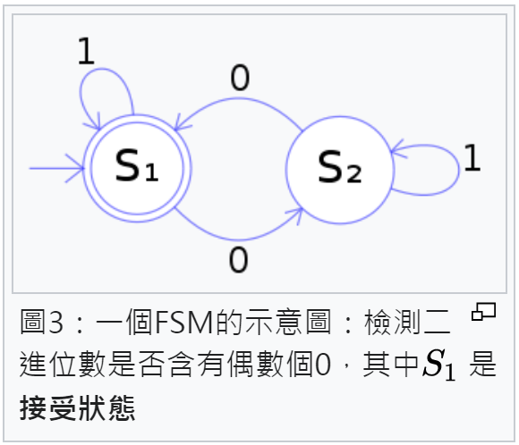
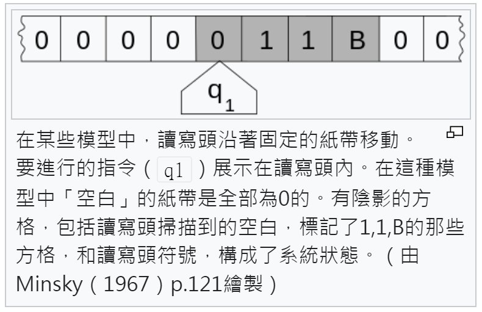
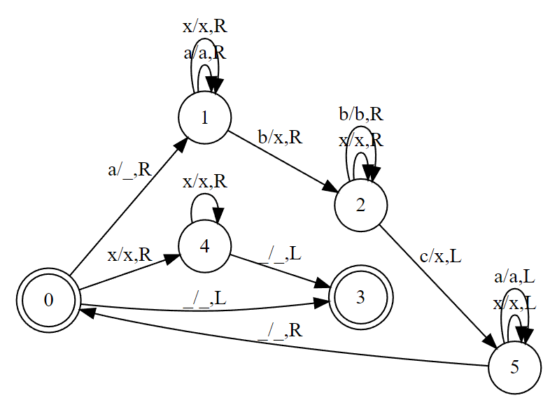

# 圖靈的機器

[λ-Calculus]:https://zh.wikipedia.org/wiki/%CE%9B%E6%BC%94%E7%AE%97

[圖靈機]:https://zh.wikipedia.org/zh-tw/%E5%9B%BE%E7%81%B5%E6%9C%BA

[丘奇]:https://zh.wikipedia.org/wiki/%E9%98%BF%E9%9A%86%E4%BD%90%C2%B7%E9%82%B1%E5%A5%87

[Kleene]:https://zh.wikipedia.org/wiki/%E6%96%AF%E8%92%82%E8%8A%AC%C2%B7%E7%A7%91%E5%B0%94%C2%B7%E5%85%8B%E8%8E%B1%E5%B0%BC

[圖靈]:https://zh.wikipedia.org/wiki/%E8%89%BE%E4%BC%A6%C2%B7%E5%9B%BE%E7%81%B5

[有限狀態機]:https://zh.wikipedia.org/zh-tw/%E6%9C%89%E9%99%90%E7%8A%B6%E6%80%81%E6%9C%BA

就在 [丘奇] 發表 [λ-Calculus] 之後不久，圖靈在 1936 年開始了對機器的研究，其成果 [圖靈機] 成為資訊科學領域的重要資產。

而 [丘奇] 正是 [圖靈] 的博士指導教授，而且也是有限狀態機發明人 [Kleene] 的指導教授，事實上 [Kleene] 對 [λ-Calculus] 的設計貢獻良多，[λ-Calculus] 是他們師生二人聯手才完成的。

## 有限狀態機

雖然在歷史上，[有限狀態機] 直到 1956 年才被正式提出，這比圖靈機晚了 20 年，但是有限狀態機比 [圖靈機] 更簡單，而且是理解 [圖靈機] 的踏腳石，所以讓我們先來介紹 [有限狀態機] 。

下圖是一個可以辨識二進位 01 字串中，是否具有偶數個 0 的有限狀態機。



其中的 S1 既是起始狀態 (被箭號指向) ，也是結束狀態 (有兩個圈圈) 。

有限狀態機若用作《接受器》，那麼可以用數學定義如下：

1. $\Sigma$ 是輸入字母表（符號的非空有限集合）。
2. S 是狀態的非空有限集合。
3. $s_{0}$是初始狀態，它是 S 的元素。
4. $\delta$ 是狀態轉移函數 $\delta :S\times \Sigma \rightarrow S$
5. F是最終狀態的集合，S 的子集。

若要作為轉換器，則必須加入《輸出函數》如下：

6. $\omega$ 是輸出函數 $\omega :S\times \Sigma \rightarrow \Gamma$ 

其中的 $\Gamma$ 是輸出字母表。

根據上面的《接受器》定義，我們可以寫出下列有限狀態機的 Python 程式

檔案： finiteStateMachine.py

```py
import json

class FiniteStateMachine:
    def __init__(self, start, finals, actionMap):
        self.actionMap = actionMap
        self.start = start
        self.finals = finals
    def accept(self, s):
        state = self.start
        i = 0
        while True:
            if i >= len(s): break
            state = self.actionMap.get(f'{state},{s[i]}')
            if state is None: return False
            i += 1
        return state in self.finals
    def __str__(self):
        return json.dumps({'start':self.start,'finals':self.finals,'actionMap':self.actionMap}, indent=2)
```

你可以看到我們用不到 20 行的程式就實作出有限狀態機了。

接著我們就可以根據上圖寫出《偶數個 0 判斷機》如下：

```py
from finiteStateMachine import FiniteStateMachine

fsm = FiniteStateMachine('s1', ['s1'], {
    's1,0':'s2',
    's1,1':'s1',
    's2,0':'s1',
    's2,1':'s2'
})
print(fsm)
print('010:', fsm.accept('010'))
print('101:', fsm.accept('101'))
print('10100:', fsm.accept('10100'))
print('1010010:', fsm.accept('1010010'))
```

執行結果

```
$ python even0.py
{
  "start": "s1",
  "finals": [
    "s1"
  ],
  "actionMap": {
    "s1,0": "s2",
    "s1,1": "s1",
    "s2,0": "s1",
    "s2,1": "s2"
  }
}
010: True
101: False
10100: False
1010010: True
```

## 圖靈機

如果你能理解上述的 [有限狀態機] ，那麼要理解 [圖靈機] 也就不難了

因為圖靈機可以想成是《加上了磁帶的有限狀態機》 ...



數學上，圖靈機是一個七元有序組 $(Q, \Sigma, \Gamma, \delta, q_0, q_{accept}, q_{reject})$ ，其中 $Q, \Sigma, \Gamma$ 都是有限集合，且滿足：

1. Q是非空有窮狀態集合；
2. $\Sigma$ 是非空有窮輸入字母表，其中不包含特殊的空白符 $\square$ 
3. $\Gamma$ 是非空有窮帶字母表且 $\Sigma \subset \Gamma$ ; 空白字元 $\square \in \Gamma -\Sigma$ 是唯一允許出現無限次的字元
4. $\delta :Q\times \Gamma \to Q\times \Gamma \times \{L,R,-\}$ 是轉移函數，其中 L, R表示讀寫頭是向左移還是向右移, - 表示不移動
5. $q_0 \in Q$ 是起始狀態
6. $q_{accept} \in Q$ 是接受狀態
7. $q_{reject}\in Q$ 是拒絕狀態，且 $q_{reject}\neq q_{accept}$ 

舉例而言，以下是一個可以辨識 $a_nb_nc_n$ 語法的圖靈機，



看起來好像很複雜，但實作為程式卻清楚得多，


檔案： anbncn.py

```py
from turingMachine import TuringMachine

tm = TuringMachine(
    ['0','1','2','3','4','5'], # 狀態集合 Q
    ['a','b','c'],             # 輸入字母表
    ['a','b','c','X','_'],     # 磁帶字母表
    {
        '0,a':'1,_,R', # 狀態 0 遇到 a 轉到 1，寫入 _, 然後向右方移動
        '1,a':'1,a,R', # 接下來都是類似的解讀方法 ...
        '1,x':'1,x,R',
        '1,b':'2,x,R',
        '2,x':'2,x,R',
        '2,b':'2,b,R',
        '2,c':'5,x,L',
        '5,x':'5,x,L',
        '5,a':'5,a,L',
        '5,b':'5,b,L',
        '5,_':'0,_,R',
        '0,x':'4,x,R',
        '0,_':'3,_,L',
        '4,x':'4,x,R',
        '4,_':'3,_,L',
    },
    '0',   # 起始狀態為 0
    ['3'], # 接受狀態集合是 3
    []     # 沒有拒絕狀態
    )

print(':', tm.run(''))
print('ab:', tm.run('ab'))
print('abtt:', tm.run('abtt'))
print('abc:', tm.run('abc'))
print('aabbc:', tm.run('aabbc'))
print('aabbcc:', tm.run('aabbcc'))
```

其執行結果如下

```
$ python anbncn.py
: True          # a0b0c0 可以接受
ab: False       # a1b1c0 不能接受
abtt: False     # 有 t 字母不能接受
abc: True       # a1b1c1 可以接受
aabbc: False    # a2b2c1 不能接受
aabbcc: True    # a2b2c2 可以接受
```

而整個圖靈機的模擬器 (虛擬機) 也只要用 35 行的 python 程式就能實作完成。

```py
class TuringMachine:
    def __init__(self, states, ichars, ochars, actionMap, start, accepts, rejects):
        self.states = states
        self.ichars = ichars
        self.ochars = ochars
        self.actionMap = actionMap
        self.start = start
        self.accepts = accepts
        self.rejects = rejects

    def action(self, state, ichar):
        line = self.actionMap.get(f'{state},{ichar}')
        if line == None: return None
        return line.split(',')

    # 參考 -- https://zh.wikipedia.org/wiki/%E5%9B%BE%E7%81%B5%E6%9C%BA#%E5%9B%BE%E7%81%B5%E6%9C%BA%E7%9A%84%E6%AD%A3%E5%BC%8F%E5%AE%9A%E4%B9%89
    def run(self, tape):
        self.tape = list(tape+'________') # 开始的时候将输入符号串，其他格子保持空白
        state = self.start # 機器一開始處於起始狀態
        i = 0 # 读写头指向第0号格子
        while True:
            ichar = self.tape[i]
            acts = self.action(state, ichar)
            if acts == None: return False
            state, ochar, move = acts # 執行動作
            self.tape[i] = ochar # 改寫這一格符號
            if move == 'L':
                if i > 0: i -= 1 # 向左移動 (但不能越過磁帶開頭)
            elif move == 'R': i += 1 # 向右移動
            elif move == '-': pass # 不移動
            else: raise Exception(f'move = {move} not allowed!')
            if state in self.accepts:
                return True
            if state in self.rejects:
                return False
```

## 停止問題不可判定

在發展出 [圖靈機] 的概念後，圖靈進一步探討圖靈機的能力，發現並證明了 [停止問題] 是沒有辦法用圖靈機解決的。

由於圖靈的證明是建構在圖靈機上的，而圖靈機又很難用幾句話簡單描述，因此我們改用「現代程式」的方法證明停止問題，證明過程如下：

停止問題採用教數學的方式來說，是我們想定義一個函數 isHalt(code, data) ，該函數可以判斷程式 code 在輸入 data 之後，是否會停止，也就是 code(data) 會不會停止。

如我用程式寫下來，可寫成如下的演算法：

```
isHalt(code, data) = 1  假如 code(data) 會停就輸出 1
                   = 0  假如 code(data) 不停就輸出 0
```

但是、假如上述函數真的存在，那麼我們就可以寫出下列這個函數：

```py
def U(code) # 故意用來為難 isHalt(code, data) 的函數。
    if isHalt(code, code)==1: # 如果 isHalt(U, U)=1，代表判斷會停
    while True: pass          #   那 U 就進入無窮迴圈不停了，所以 isHalt(U,U) 判斷錯誤了。
  else                        # 如果 isHalt(U, U)=0，代表判斷不停
    exit()                    #   那 U 就立刻停止，所以 isHalt(U,U) 又判斷錯誤了。
```

如此、請問 isHalt(U,U) 應該是甚麼呢？ 這可以分成兩種情況探討：

```
1. 假如 isHalt(U, U) 傳回 1，那麼就會進入無窮回圈 loop forever，
   也就是 U(U) 不會停 

=> 但是 isHalt(U,U)=1 代表 isHalt 判斷 U(U) 是會停的啊？
   於是 isHalt(U, U) 判斷錯誤了。

2. 假如 isHalt(U, U) 傳回 0，那麼就會進入 else 區塊的 halt，
   也就是 U(U) 會立刻停止

=> 但是 isHalt(U,U)=0 代表 isHalt 判斷 U(U) 是不會停的啊？
   於是 isHalt(U, U) 又判斷錯誤了。
```

於是、我們證明了停止問題是不可能做到 100% 正確的，因為 isHalt 永遠對 U(U) 做了錯誤的判斷。

從上述的論證中，我們看到 isHalt(code, data) 這個問題是無法被 100% 正確解答的，因為這個問題與「羅素的理髮師問題」一樣，都是會導制矛盾的，因此我們可以根據「矛盾證法」的推論，發現這樣的問題是無法被「圖靈機或現代電腦」所正確解答的。

在 「韓非子/難一」 篇當中，曾經提到一個「矛與盾」的故事，原文截錄如下：

楚人有鬻楯與矛者，譽之曰︰『吾楯之堅，物莫能陷也。』又譽其矛曰︰『吾矛之利，於物無不陷也。』或曰︰『以子之矛陷子之楯，何如？』其人弗能應也。

現代電腦的能力基本上也只相當於一個記憶空間有限的圖靈機，因此一但證實了圖靈機無法解決某問題，那麼現代電腦也就無法解決該問題了。

相反的、假如我們可以證明「一個擁有無限記憶體的現代電腦」無法解決某個問題，那麼、應該也就可以證明圖靈機無法解決該問題了。

## 結語

看到這裡，你應該會發現，圖靈論述的停止問題不可判定，和丘奇在論述兩個 λ-Calculus 函數無法互相轉換上，非常的類似！

## 參考文獻

* Moore, Edward F. Gedanken-experiments on Sequential Machines. Automata Studies,Annals of Mathematical Studies (Princeton, N.J.: Princeton University Press). 1956, (34): 129–153.

