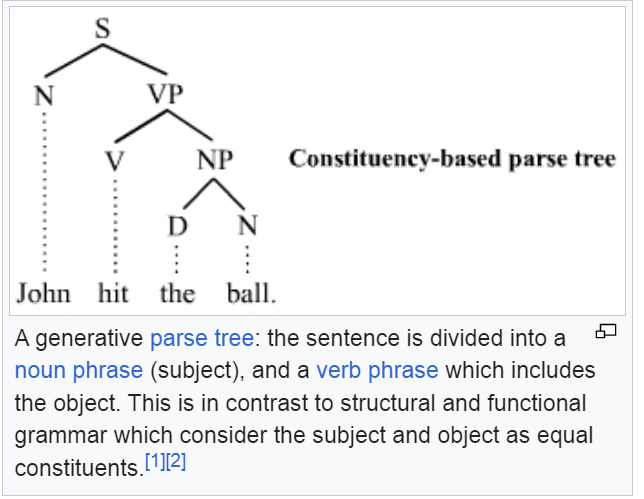
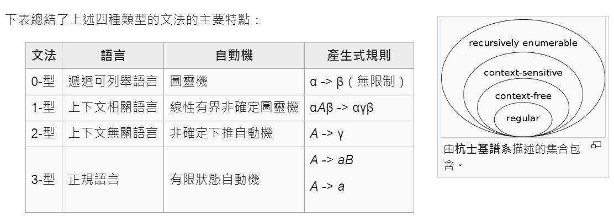

# 喬姆斯基的語法

[喬姆斯基]:https://zh.wikipedia.org/wiki/%E8%AF%BA%E5%A7%86%C2%B7%E4%B9%94%E5%A7%86%E6%96%AF%E5%9F%BA
[生成語法]:https://zh.wikipedia.org/zh-tw/%E7%94%9F%E6%88%90%E6%96%87%E6%B3%95

[喬姆斯基] 是語言學大師，[生成語法] 的創始人，被稱為現代語言學之父，1928 年出生，今年 2023 年，他 95 歲了，有時你還可以看到新聞去採訪他。

## 生成語法

喬姆斯基在1957年所寫的《文法結構》的出版是《轉換-生成文法》 (Transformational-generative grammar，簡稱TG) 誕生的標誌。簡單的說，轉換-生成文法理論研究的是人類為什麼會說話以及如何了解新的句子。

在1957年所出版的《文法結構》和1965年的《文法理論要略》兩書被喬姆斯基稱為「標準理論」。此後他又修正了些許這些理論，稱為「擴展的標準理論」，後又修訂擴展的標準理論，形成「修正的擴展的標準理論」。



[BNF]:https://en.wikipedia.org/wiki/Backus%E2%80%93Naur_form

但是和喬姆斯基差不多的時期，電腦領域也開始了語法研究，像是 [BNF] 就是由 Fortran 程式語言的創建者 John Backus 和 Peter Naur 所創建的，用來描述程式語言的一種語法。

John Backus 首次在ALGOL 58 中實作出 [BNF]。Peter Naur 在ALGOL 60之中，進一步發展它的概念並將它的符號加以簡化，稱其為 Backus Normal Form

但後來 Knuth 主張應稱 Backus–Naur Form，因為它不算是一種正規形式（Normal form）。

不管如何，這樣的觀念在《語言學和電腦》兩個領域，幾乎被同時發展出來，而且互相影響著。

## 用語法生成語言

不管是描述《中文、英文還是程式》，我們都會用語法。

舉例而言，以下語法描述了一個簡單的英文系統 (貓狗世界)。

```
S => NP VP
NP => D N
VP => V NP
N => "dog" | "cat"
V => "eat" | "chase"
D => "a" | "the"
```

為了用 python 實作，我們將其放入字典結構，變成下列程式

```py
import grammar

G = {
    "S":["NP VP"],
    "NP":["D N"],
    "VP":["V NP"],
    "N":["dog", "cat"],
    "V":["eat", "chase"],
    "D":["a", "the"]
}

grammar.gen(G)
```

然後我們可以執行看看

```
$ python english.py
 NP VP
 D N VP
 D N V NP
 D N V D N
 D dog V D N
 D dog V D dog
 D dog eat D dog
 the dog eat D dog
 the dog eat the dog

$ python english.py
 NP VP
 D N VP
 D N V NP
 D N V D N
 D dog V D N
 D dog V D cat
 D dog chase D cat
 a dog chase D cat
 a dog chase the cat
```

你會發現每次結果都不太一樣，但看來都是結構良好的英文語句。

這是因為我們在其中有使用到隨機選擇。

以下是我們的 grammar.py 語法模組

```py
import random

def gen(G, start="S"):            # 根據語法 G 生成語句
    lefts = list(G.keys())        # 取得所有規則中的左式 (A=>B 中的 A)
    rule = f" {start} "           # 起始符號
    while True:                   # 不斷重複的生成迴圈
        for left0 in lefts:       # 對於每個左式
            left = f' {left0} '   # 在前後補上空白成為 left
            i = rule.find(left)   # 找找看目前的展開式 rule 當中有沒有這個左式 left
            if i != -1:           # 如果有找到
                rights = G[left0] # 就取得對應的右式集合 rights
                right = f' {random.choice(rights)} ' # 隨機取得右式集合裏的一個為 right
                rule = rule[0:i]+right+rule[i+len(left):] # 將左式 left 取代為右式 right
                print(rule)       # 印出目前結果以便觀察
                if rule == rule.lower(): # 如果已經全都是小寫 (非終端項目)
                    return rule   # 那就已經生成完畢，傳回！
                break             # 有生成展開的話，就 break 換新的一輪展開

```

如果你看過本書前面的章節，或許會發現這個程式，和《有限狀態機的展開》，還有《邏輯推理系統的展開》，運作機制非常相像。

這些過程大概都是，找到待展開的對象 《左式》，然後呼叫 《右式》 的動作，只是每個系統的《右式》動作不太一樣而已。

## 喬姆斯基階層

喬姆斯基厲害的地方，是他有系統地將生成語法分為 0,1,2,3 等四種類型，而這四種類型右分別可以對應到四種機器。



根據上圖，我們重新詮釋如下

文法 | 語言              | 機器             | 生成規則         | 範例
-----|-------------------|-----------------|------------------|---------------
0 型 | Recursive Enumerable | 圖靈機           | $\alpha  \rightarrow \beta$ | 
1 型 | Context Sensitive | 線性有界圖靈機   | $\alpha A \beta \rightarrow \alpha \gamma \beta$ | $a_n b_n c_n$
2 型 | Context Free      | 下推自動機       | $A\rightarrow \alpha$     | $a_n b_n$
3 型 | Regular Language  | 有限狀態機       | $A \rightarrow a \mid aB$ | $a_n b_m$

你可以看到，在喬姆斯基的體系裏面，非常的有系統，而且很有道理，舉例而言：

[有限狀態機] 對應到 $A \rightarrow a \mid aB$ 這樣的語法，為甚麼呢？

那是因為 [有限狀態機] 會根據輸入進行狀態轉移

1. $A \rightarrow aB$ 可以解釋為在 A 狀態碰到 a 字母之後，就會轉移到 B 狀態。
2. $A \rightarrow a$ 可以解釋為 A 狀態碰到 a 字母之後就進入結束狀態。

對於熟悉 [正規表達式] (Regular Expression) 的程式人而言，這種語法對應的就是正規表達式所能表達的語言。

再舉一個例子，如果你看 Context Sensitive 的語法 $\alpha A \beta \rightarrow \alpha \gamma \beta$ ，你就會發現該語法利用 A 前後的 $\alpha$ 與 $\beta$ 來抓住前後文，因此可以做到根據前後文來決定要不要觸發規則展開的功能。

這種根據前後文展開的特性，就稱為《上下文相關語言》 (Context Sensitive Language)。

然後喬姆斯基舉了一些經典範例，說明那些語法能產生甚麼語言

文法 | 語言 | 生成規則         | 範例
-----|------|-------------|-----------------
0 型 | Recursive Enumerable | $\alpha  \rightarrow \beta$         
1 型 | Context Sensitive | $\alpha A \beta \rightarrow \alpha \gamma \beta$ | $a_n b_n c_n$
2 型 | Context Free | $A\rightarrow \alpha$     | $a_n b_n$
3 型 | Regular Language  | $A \rightarrow a \mid aB$ | $a_n b_m$

## 3 型 -- 正規語言 (Regular Language)

舉例而言 $a_n b_m$ 可以用下列規則產生，這些都是 3 型的生成規則，所以該文法為 regular grammar

```
S=>A
A=>a A | B
B=>b B | b
```

讓我們用上面的 Python 來執行看看

檔案： anbm.py

```py
import grammar

G = {
    "S":["A"],
    "A":["a A", "a A", "a A", "B"], # 重複三次 a A 是為了增大該情況的機率為三倍
    "B":["b B", "b B", "b B", "b"]  # 重複三次 b B 是為了增大該情況的機率為三倍
}

grammar.gen(G)
```

執行結果

```
$ python anbm.py
 A
 a A
 a a A
 a a a A
 a a a a A
 a a a a B
 a a a a b B
 a a a a b b B
 a a a a b b b

$ python anbm.py
 A
 B
 b
```

## 2 型 -- 上下文無關語言 (Context Free)

上下文無關語言的一個經典案例是 $a_n b_n$ ，也就是 n 個 a 之後跟著 n 個 b。(這個無法用第 3 型的 regular 語法生成)

```
S=>a S b | a b
```

```py
import grammar

G = {
    "S":["a S b","a S b","a S b","a b"] # 產生 anbn
    # 上面重複三次 a S b 是為了增大該情況的機率為三倍
}

grammar.gen(G)
```

執行結果

```
$ python anbn.py
 a S b
 a a S b b
 a a a S b b b
 a a a a b b b b

$ python anbn.py
 a S b
 a a S b b
 a a a S b b b
 a a a a S b b b b
 a a a a a S b b b b b
 a a a a a a b b b b b b
```

## 1 型 -- 上下文相關語言 (Context Sensitive)

上下文相關語言的一個經典案例是 $a_n b_n c_n$ ，也就是 n 個 a 之後跟著 n 個 b，然後再跟著 n 個 c。(這個無法用第 2 型的 Context Free 語法生成)


```
S => a B C | a S B C
C B => C Z
C Z => W Z
W Z => W C
W C => B C
a B => a b
b B => b b
b C => b c
c C => c c
```

```py
import grammar

G = { # 產生 an bn cn
    "S":["a B C","a S B C","a S B C","a S B C"],
    # 上面重複三次 a S B C 是為了增大該情況的機率為三倍
    "C B":["C Z"], # CB=>CZ=>WZ=>WC=>BC 導致 C 和 B 交換
    "C Z":["W Z"],
    "W Z":["W C"],
    "W C":["B C"],
    "a B":["a b"], # 換成小寫
    "b B":["b b"],
    "b C":["b c"],
    "c C":["c c"]
}

grammar.gen(G)
```

執行結果

```
$ python anbncn.py
 a B C
 a b C
 a b c

$ python anbncn.py
 a S B C
 a a S B C B C
 a a a B C B C B C
 a a a B C Z C B C
 a a a B C Z C Z C
 a a a B W Z C Z C
 a a a B W Z W Z C
 a a a B W C W Z C
 a a a B W C W C C
 a a a B B C W C C
 a a a B B C B C C
 a a a B B C Z C C
 a a a B B W Z C C
 a a a B B W C C C
 a a a B B B C C C
 a a a b B B C C C
 a a a b b B C C C
 a a a b b b C C C
 a a a b b b c C C
 a a a b b b c c C
 a a a b b b c c c
```

## 0 型 -- 遞歸可枚舉語言 (Recursive Enumerable)

[邱奇-圖靈猜想]:https://zh.wikipedia.org/wiki/%E9%82%B1%E5%A5%87-%E5%9B%BE%E7%81%B5%E8%AE%BA%E9%A2%98

0 型語法基本上對應到 圖靈機 的能力，

但是有個理論叫做 [邱奇-圖靈猜想] ，該理論說

> 任何在算法上可計算的問題同樣可由圖靈機計算

意思就是 λ-Calculus 這種使用遞迴方式的程式能力，基本上和圖靈機一樣。 

(而且任何使用遞迴方式的程式語言能力都一樣，任何通用計算機的能力也都和圖靈機一樣)

## 結語

但是、這並不表示 λ-Calculus 或圖靈機能計算任何函數，或辨識任何語言。

因為根據丘奇的證明，兩個 λ-Calculus 是否相等，是一個不可解問題。

而根據圖靈的證明，停止問題也是個不可解問題。

所以有些語言是沒辦法用電腦或程式正確辨識的。
