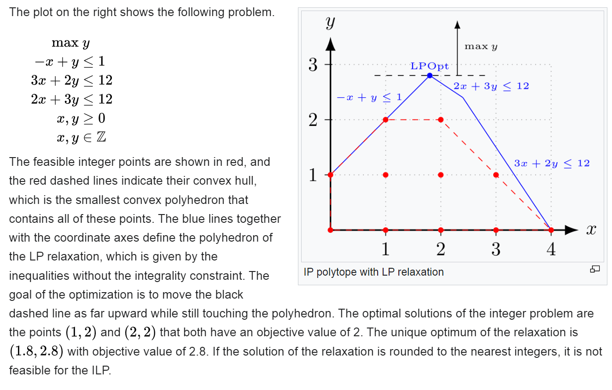
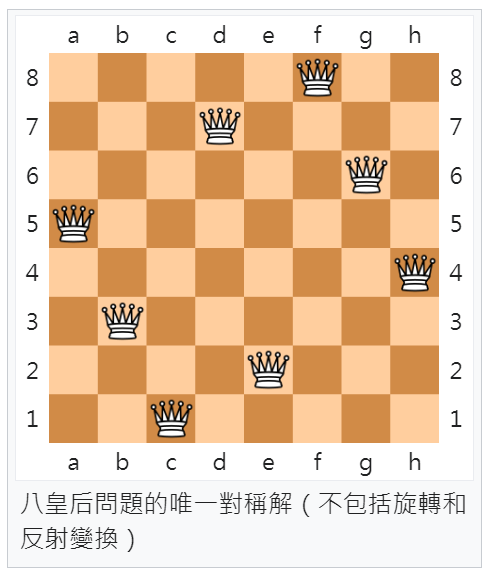
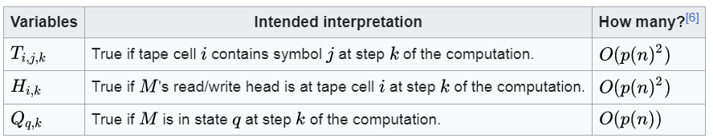
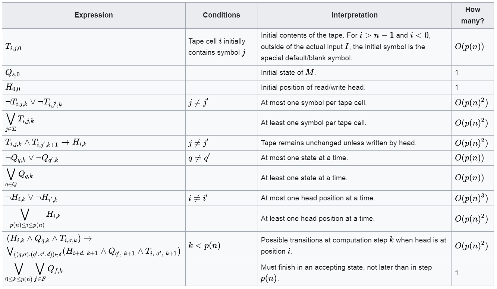

# 庫克的證明

## 非確定型圖靈機

[庫克]:https://zh.wikipedia.org/wiki/%E5%8F%B2%E8%92%82%E8%8A%AC%C2%B7%E5%BA%93%E5%85%8B
[確定型圖靈機]:https://en.wikipedia.org/wiki/Deterministic_Turing_machine
[非確定型圖靈機]:https://zh.wikipedia.org/wiki/%E9%9D%9E%E7%A1%AE%E5%AE%9A%E5%9E%8B%E5%9B%BE%E7%81%B5%E6%9C%BA

[P]:https://en.wikipedia.org/wiki/P_(complexity)
[NP]:https://en.wikipedia.org/wiki/NP_(complexity)
[P=NP]:https://en.wikipedia.org/wiki/P_versus_NP_problem
[多項式時間]: 

在計算理論領域，圖靈機的一個重要貢獻，是 [非確定型圖靈機] 的概念，
這個《非確定型》的想法，對後來的計算複雜度與 NP-Complete 觀念是非常重要的。

## P 與 NP

所謂的 [NP] ，就是 Nondeterministic Polynomial time ，也就是 [非確定型圖靈機] 
可以在 [多項式時間] 內解決的問題。

而 [P] 則是 Polynomial time ，也就是 [確定型圖靈機] 可以在多項式時間內解決的問題。

而 [P=NP] 問題，則是從 1972 年 [庫克] 提出來之後，一直沒有被解決的問題，而且很可能今後也沒有人能解決這個問題。

## NP-Complete 

但是 [庫克] 並不只是提出問題，他還證明了所謂 [NP-Complete] 是一組相互之間可以轉換後解決的問題，並因此而獲得了 1982 年的圖靈獎。

因此這些問題就被綁在一起了，只要一個能在多項式時間解決，其他問題也都會變成 [P] 的問題。

為何 [庫克] 能將這一大群問題綁在一起呢？

[歸約]:https://zh.wikipedia.org/wiki/%E6%AD%B8%E7%B4%84

[Reduction]:https://zh.wikipedia.org/wiki/%E6%AD%B8%E7%B4%84

這牽涉到 [Reduction] ( [歸約] ) 的觀念 ...

## Reduction (歸約)

所謂的 [歸約] ，是將一個問題 A 轉成問題 B 的輸入形式後，再由問題 B 的算法 b() 去解決，然後再將結果轉回問題 A 的解答形式，這樣就完成了 [歸約] 的過程。

換言之，假如函數 b() 可以解決 B 問題，那麼我們就可以寫出下列 a() 函數去解決  A 問題。

```py
def a(ia):
    ib = a2b(ia) # 將 A 問題的輸入 ia 轉為 B 問題的輸入 ib
    ob = b(ib)   # 用 b() 去解決 B 問題
    oa = b2a(ob) # 再將 B 的輸出結果 ob 轉回 A 問題的輸出 oa
    return oa    # 得到 A 問題的解答
```

舉例而言，整數規劃是用來找限制條件下某函數的最大值 (或最小值)，但條件是那些解答必須是整數，不可以有小數部分。

舉例而言，下圖是維基百科上的一個整數規劃問題，該問題想最大化 y (max y) ，但是卻受到圖圖中的那些條件限制。



[八皇后問題]:https://zh.wikipedia.org/zh-tw/%E5%85%AB%E7%9A%87%E5%90%8E%E9%97%AE%E9%A2%98

n-queens (n 個皇后問題) 是根據西洋棋的皇后移動攻擊規則所衍生出來的一個數學解謎問題

由於西洋棋的皇后可以《垂直、水平以及斜角移動》，所以威力非常大，那麼我們要如何把 n 個皇后安排在一個棋盤上，卻又不能互相攻擊呢？

這就是所謂的 n 皇后問題，而其最常見的 n 為 8，也就是 [八皇后問題] 。



雖然看起來 n 皇后問題和 [整數規劃] 一點關係都沒有，但我們可以透過巧妙的轉換，用整數規劃來解決 n 皇后問題。

以下是我們用 mip 這個整數規劃套件求解 8 皇后問題的過程。

```
$ python queen8.py
Welcome to the CBC MILP Solver
Version: Trunk
Build Date: Oct 28 2021

Starting solution of the Linear programming relaxation problem using Primal Simplex

Coin0506I Presolve 40 (-1) rows, 64 (0) columns and 247 (-1) elements
Clp1000I sum of infeasibilities 3.57996e-11 - average 8.9499e-13, 2 fixed columns

...
Cbc0035I Maximum depth 0, 0 variables fixed on reduced cost
Total time (CPU seconds):       0.30   (Wallclock seconds):       0.30


. . O . . . . .
. . . . . . . O
. . . O . . . .
. . . . . . O .
O . . . . . . .
. . . . . O . .
. O . . . . . .
. . . . O . . .
```

其中 queen8.py 的程式碼如下

```py
# https://github.com/coin-or/python-mip/blob/master/examples/queens.py
"""Example of a solver to the n-queens problem:  n chess queens should be
placed in a n x n chess board so that no queen can attack another, i.e., just
one queen per line, column and diagonal.  """

from sys import stdout
from mip import Model, xsum, BINARY

# number of queens
n = 8 # 皇后數量為 8 個

queens = Model()

x = [[queens.add_var('x({},{})'.format(i, j), var_type=BINARY)
      for j in range(n)] for i in range(n)]

# one per row # 每個水平 row 只能有一個皇后
for i in range(n):
    queens += xsum(x[i][j] for j in range(n)) == 1, 'row({})'.format(i)

# one per column # 每個垂直 column 只能有一個皇后
for j in range(n):
    queens += xsum(x[i][j] for i in range(n)) == 1, 'col({})'.format(j)

# diagonal \  # 每個 \ 斜角線只能有一個皇后
for p, k in enumerate(range(2 - n, n - 2 + 1)):
    queens += xsum(x[i][i - k] for i in range(n)
                   if 0 <= i - k < n) <= 1, 'diag1({})'.format(p)

# diagonal / # 每個 / 斜角線只能有一個皇后
for p, k in enumerate(range(3, n + n)):
    queens += xsum(x[i][k - i] for i in range(n)
                   if 0 <= k - i < n) <= 1, 'diag2({})'.format(p)

queens.optimize() # 呼叫整數規劃套件的優化函數

if queens.num_solutions: # 如果有解答，就印出來
    stdout.write('\n')
    for i, v in enumerate(queens.vars):
        stdout.write('O ' if v.x >= 0.99 else '. ')
        if i % n == n-1:
            stdout.write('\n')
```

這樣，我們就輕輕鬆鬆地用整數規劃套件，解決了八皇后問題。

這就是 [歸約] ([Reduction]) 的威力 ...

## SAT 問題

庫克證明了 SAT 問題是 NP-Complete 問題。

所謂 SAT 問題，就是《布林式是否能被滿足的問題》

舉例而言，我們可能會問 `(x or y) and (x or not z)` 這個布林式是否能被滿足

根據下列的結果，我們知道該式在 (x,y,z) = (0,1,0) 的時候為 True，因此可以被滿足

檔案: expEval.py

```py
assign = (x,y,z) = (0,1,1)
exp = '(x or y) and (x or not z)'
result = eval(exp)
print('exp=', exp, 'assign=', assign, 'result=', result)
assign = (x,y,z) = (0,1,0)
result = eval(exp)
print('exp=', exp, 'assign=', assign, 'result=', result)
```

執行結果

```
$ python expEval.py
exp= (x or y) and (x or not z) assign= (0, 1, 1) result= False
exp= (x or y) and (x or not z) assign= (0, 1, 0) result= True
```

如果我們用暴力法把 n 變數的所有可能 $2^n$ 個輸入，那麼就能知道任一個 n 變數的邏輯式是否能被滿足了。

> 因為只要有任何一個輸入結果會輸出 1 (True)，那就是可以被滿足 (若全部都為 0 ，那就不能被滿足)

以下就是我們用暴力法測試某邏輯式是否能被滿足的程式

```py
g = globals()

def satisfy(exp, vars, values): # 測試 exp 在指令 vars[0..i]=values[0..i] 時，是否能被滿足。
    if len(values) == len(vars):
        for i in range(len(vars)):
            g[vars[i]] = values[i]
        result = eval(exp)
        print(values, '=>', result)
        if result: return values
        return None
    v0 = values.copy()
    v1 = values.copy()
    v0.append(0)
    v1.append(1)
    return satisfy(exp, vars, v0) or satisfy(exp, vars, v1)


def SAT(exp, vars) :
    print('exp=', exp)
    print(vars) 
    values = satisfy(exp, vars, [])
    return {'answer':values}


print(SAT('(x or y) and (not x or not z) and (x) and (y)', ['x', 'y', 'z']))
print(SAT('(x) and (not x) and (not y) and (not z)', ['x', 'y', 'z']))
```

執行結果

```
ccckmit@asus MINGW64 /d/ccc/ccc112a/book/code_theory/06-庫克的證明/SAT (main)
$ python sat.py
exp= (x or y) and (not x or not z) and (x) and (y)
['x', 'y', 'z']
[0, 0, 0] => 0
[0, 0, 1] => 0
[0, 1, 0] => 0
[0, 1, 1] => 0
[1, 0, 0] => 0
[1, 0, 1] => False
[1, 1, 0] => 1
{'answer': [1, 1, 0]}
exp= (x) and (not x) and (not y) and (not z)
['x', 'y', 'z']
[0, 0, 0] => 0
[0, 0, 1] => 0
[0, 1, 0] => 0
[0, 1, 1] => 0
[1, 0, 0] => False
[1, 0, 1] => False
[1, 1, 0] => False
[1, 1, 1] => False
{'answer': None}
```

根據上述執行結果，你會發現在

1. `(x or y) and (not x or not z) and (x) and (y)` 在 (x=1,y=1,z=0) 時會被滿足而輸出 1 (True)
2. `(x) and (not x) and (not y) and (not z)` 這個邏輯式是無法被滿足的 (全部都是 0 或 False)

SAT 問題定義很清楚，而且用暴力法寫起來並不難，但問題是當變數 n 很大的，用暴力法會非常慢，慢到完全無法接受。

假如有 1024 個變數，那麼我們就要找 $2^1024$ 次，那是多大呢？

答案是 

> 179769313486231590772930519078902473361797697894230657273430081157732675805500963132708477322407536021120113879871393357658789768814416622492847430639474124377767893424865485276302219601246094119453082952085005768838150682342462881473913110540827237163350510684586298239947245938479716304835356329624224137216

這到底是多大的數字，我也搞不清楚，但我知道拿去我的電腦跑， 100 年之內應該是出不來，100 億年後出不出得來都是個問題。

那如果該邏輯式有 1 萬個變數呢？

但是，如果你指定好每個變數是 0 或 1 給我，那麼我一下就能告訴你那個指定值的輸出是 0 或 1。

NP-Complete 的問題，幾乎都和 SAT 一樣，給定指定輸入，我們可以很快判斷該輸入是否符合。

但是若要求得符合的解或最佳解，那目前都得花上 $O(2^n)$ 以上的時間。

## SAT 問題是 NP-Complete

[Cook Levin Theorem]:https://en.wikipedia.org/wiki/Cook%E2%80%93Levin_theorem

庫克證明該定理的想法其實也不難，就是從非決定性圖靈機下手

所謂的《非決定性圖靈機》，你可以想像成一台超級平行圖靈機，這個圖靈機會對所有可能的組合進行嘗試。

但是嚴格說來這樣不太對，不是所有組合同時進行嘗試，而是當分成 n 條路時，該圖靈機可以問上帝說，哪條路有解，然後上帝會告訴你，接著你就走有解的那條路繼續試。(這種機制稱為神諭 Oracle)

所以庫克的想法是，任何一台非決定圖靈機要解決某問題，如果有一條路徑可以在多項式時間內找到解，那就稱為 NP (Non-deterministic Polynomial) 。

那我們只要將該圖靈機，用邏輯式描述出來，這樣我們若能寫判斷該邏輯式有沒有解，就知道該非決定性圖靈機是否能找到答案了。

這就是 SAT 問題為何是 NP-Complete 的原因了，因為任何非決定性圖靈機找不找得到答案的問題，都可以轉化為 SAT 問題。

那麼庫克是如何用邏輯式描述非決定圖靈機的呢？

先讓我們看看下列用來描述圖靈機的邏輯變數



庫克用

1. $T_{i,j,k}$ 代表磁帶第 i 格在第 k 步時是否為符號 j
2. $H_{i,k}$ 代表讀寫頭在第 k 步時是否在第 i 格上
3. $Q_{q,k}$ 代表第 k 步時狀態是否為 q

雖然這些變數很多，但都還是在多項式範圍內，所以沒問題。

接著庫克就對用邏輯式來表達整台圖靈機的所有限制條件，這些限制條件的邏輯式雖然比變數多得多，但也都是在多項式範圍內，所以沒問題。



這樣的話，整個系統就是一個超大的邏輯式，只要你能找到滿足該邏輯式的解，你就知道那台非決定性圖靈機是否能找到解了。

圖靈機和一般機器不同，每台圖靈機都是為解決一個特定問題設計的，換言之，圖靈機就是一組《機器+程式》。

所以只要 SAT 問題能夠在多項式時間內解出來，那麼所有能用非決定性圖靈機在多項式時間內完成的問題，就都能在多項式時間內解出來了。

這就是庫克將《所有 NP 問題 [歸約] reduce 為 SAT 的方法》。

## 結語

現在你應該知道 NP 問題是甚麼，也知道為何 SAT 是 NP-Complete 問題了。

由於我們可以輕易的把 SAT 問題轉成 [整數規劃] 問題，而且整數規劃的解答也可以在多項式時間內檢查是否符合條件，因此 [整數規劃] 也是 NP-Complete 問題。

另外，還有很多看來不相關的問題，都被證明是 NP-Complete ，證明的關鍵正是用 [歸約] 法。

但直到現在為止， P 是否等於 NP ，仍然沒有被證明或否證，而且在可預期的未來，或許都無法被證明或否證。

因為每年，都有一些人寫論文說他們證明了 P=NP ，或者證明了 P 與 NP 不相等，但是每個證明都是錯的，所以後來的學者只要看到有人寫這樣的論文，都是直接丟掉不看的 ...
