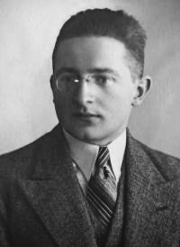
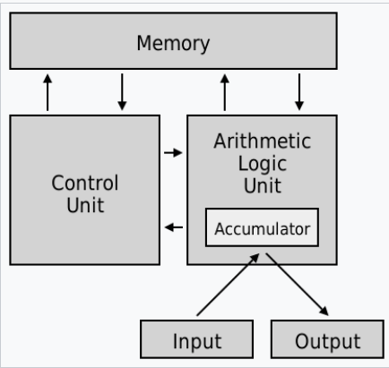

# 馮紐曼的報告

[模仿遊戲]:https://zh.wikipedia.org/zh-tw/%E6%A8%A1%E4%BB%BF%E6%B8%B8%E6%88%8F

[圖靈]:https://zh.wikipedia.org/wiki/%E8%89%BE%E4%BC%A6%C2%B7%E5%9B%BE%E7%81%B5

[Enigma]:https://en.wikipedia.org/wiki/Enigma_machine

[Bomba]:https://en.wikipedia.org/wiki/Bomba_(cryptography)

## Enigma 密碼機的破解

在 [模仿遊戲] 這部電影裏，我們看到波蘭數學家試圖破解德軍 Enigma 機器的密碼，然後 [圖靈] 絞盡腦汁要建立一台可以自動破解密碼的 Bomb 機，

但根據我在維基百科上查到的資訊，波蘭數學家 Marian Rejewski 其實已經在 1938 年就創建了 [Bomba] 機。

<!--  -->

但由於德軍已經警覺到 Enigma 可能已經被破解，於是修改了設計。

[布萊切利莊園]:https://zh.wikipedia.org/wiki/%E5%B8%83%E8%90%8A%E5%88%87%E5%88%A9%E5%9C%92

後來波蘭被德軍佔領，於是 Marian Rejewski 逃到了英國，圖靈接手工作，繼續在英國軍方支持的 [布萊切利莊園] 研發出更新版的 [Bombe] 機以破解新型的 [Enigma] 機。

不過這些破解密碼的機器，都是特殊用途的設計，和後來的通用型電腦差異很大。

[ENIAC]:https://zh.wikipedia.org/wiki/%E9%9B%BB%E5%AD%90%E6%95%B8%E5%80%BC%E7%A9%8D%E5%88%86%E8%A8%88%E7%AE%97%E6%A9%9F

## ENIAC 通用電腦

在二次大戰末期，美國開始研發通用型電腦 ENIAC，陸軍資助了 ENIAC 的設計和建造，並在 1943年6月5日 簽訂了合約，以 PX 為代號，在賓夕法尼亞大學穆爾電氣工程學院秘密研發。

1946年2月14日公布後，在賓夕法尼亞大學正式開始使用，總共花了五十萬美元。後來也被陸軍軍械兵團作為軍事用途使用。

ENIAC可以編程，執行複雜的操作序列，可以包含循環、分支和子程序。獲取一個問題並把問題映射到機器上是一個複雜的任務，通常要用幾個星期的時間。當問題在紙上搞清楚之後，通過操作各種開關和電纜把問題「弄進」ENIAC還要用去幾天的時間。然後，還要有一個驗證和測試階段，由機器的「單步執行」能力協助測試。

ENIAC是賓夕法尼亞大學 John Mauchly 和 J. Presper Eckert 構思和設計的。協助開發的設計工程師團隊包括 Robert F. Shaw（函數表）、Jeffrey Chuan Chu（除法器/平方-平方根器）、Thomas Kite Sharpless（主要程序員）、Arthur Burks（乘法器）、Harry Huskey（讀取器/列印器），還有 Jack Davis（累加器）。ENIAC在1987年被評為IEEE里程碑之一。

但其實程式主要是由幾位女性數學家寫的，包含 Jean Jennings, Marlyn Wescoff, Ruth Lichterman, Betty Snyder, Frances Bilas, and Kay McNulty.

雖然 ENIAC 已經是很了不起的成就，但卻有很多缺點，像是《複雜、故障率高、很難將程式輸入、採用十進位運算而非二進位、使用真空管、記憶體很小》等等問題。

不過 ENIAC 並非全世界第一台計算機，以下的電腦比 ENIAC 還早。

1. 德國 Z3 計算機（1941年5月公布）是 Konrad Ernst Otto Zuse 設計的。這是第一台通用的數字計算機。但是它是機電計算機，而不是電子計算機，因為所有功能都使用繼電器。它使用二進位數學進行邏輯地計算。它可用打孔紙帶編程，但是沒有邏輯分支。儘管當初設計的不是圖靈完全的，但是在1998年人們發現它是圖靈完全的（但是如果要利用這種圖靈完全性質，需要複雜、聰明的破解）。1943年，這台計算機在柏林毀於轟炸襲擊。

2. 美國 Atanasoff–Berry 計算機（ABC，1941年夏天公布）是第一台電子計算設備。它使用真空管實現了二進位計算，但是不是通用的，而是僅僅用於求解線性方程組。這台計算機也沒有利用電子計算的速度優勢。有兩方面限制了它的速度：一是旋轉電容鼓存儲器，另一個是它的輸入輸出系統要把中間結果寫出到紙片上。這台計算機是手動控制的，並且不可程式。

3. 英國的巨人計算機（Colossus computer，1943年用於密碼分析）是 Tommy Flowers 設計的。這些計算機是數字的、電子的，可用插板和開關編程，但是僅用於密碼破譯，並不是通用的。

4. Howard Hathaway Aiken 在1944年設計的 Harvard Mark I (馬克一號) 電腦使用繼電器，可用打孔紙帶編程。可以計算一般的數學函數，但是沒有分支結構。

## EDVAC 與馮紐曼架構

[馮紐曼]:https://zh.wikipedia.org/wiki/%E7%BA%A6%E7%BF%B0%C2%B7%E5%86%AF%C2%B7%E8%AF%BA%E4%BC%8A%E6%9B%BC

[馮紐曼的報告]:https://zh.wikipedia.org/wiki/EDVAC%E5%A0%B1%E5%91%8A%E6%9B%B8%E7%9A%84%E7%AC%AC%E4%B8%80%E4%BB%BD%E8%8D%89%E6%A1%88

[馮紐曼的報告原稿]:https://ia600208.us.archive.org/32/items/firstdraftofrepo00vonn/firstdraftofrepo00vonn.pdf 

[馮紐曼的報告IEEEAHC]:https://web.mit.edu/STS.035/www/PDFs/edvac.pdf

[冯·诺依曼体系结构：计算机组成的金字塔]:https://zhuanlan.zhihu.com/p/64332433

[馮紐曼] 以科學顧問委員的身分參與了 ENIAC 與後來的 EDVAC 計畫，因而知道了 ENIAC 的設計與缺點，以及後來 EDVAC 的一些設計想法。

[馮紐曼] 同時也參加了原子彈的曼哈頓計畫，於是在坐火車通勤到曼哈頓計畫所在地的洛斯阿拉莫斯時，以手寫的方式撰寫了此份報告，並寄回費城給 EDVAC 相關人員。

[馮紐曼架構]:https://zh.wikipedia.org/wiki/%E5%86%AF%C2%B7%E8%AF%BA%E4%BC%8A%E6%9B%BC%E7%BB%93%E6%9E%84

在報告中馮紐曼提出了著名的 [馮紐曼架構] ，這對後來的電腦硬體設計影響深遠，以至於我們都認為這樣的架構應該是理所當然的。

但是、很多看來理所當然的技術，其實是前人嘗試了無數錯誤之後，才發展出來的，舉例而言：

1. 電腦用 2 進位不是理所當然嗎？ 
    * ENIAC 可是用 10 進位的設計喔
2. 負整數用 2 補數表示法不是理所當然嗎？
    * 之前可是有 1 補數和有號數喔
3. 電腦打開就會有畫面，然後有視窗介面不是理所當然嗎？
    * 在全錄 Xerox 的 Alto 電腦之前，視窗介面是不存在的，全都是命令列介面，後來賈伯斯用了 5% Apple 公司股份賣給 Xerox ，只為了換取可以進全錄 PARC 研究中心去看 Alto 這台電腦的技術是怎麼做的
4. 電腦上有個命令列介面不是理所當然嗎？
    * 在大型主機時代，可是有打孔卡電腦，程式必須在打孔卡上刻出來，才可以交給機房人員去放到讀卡機，然後你明天去拿報表看看跑出來的結果有沒有錯(那個年代連螢幕都沒有，輸出是用印表機) 。
5. 電腦可以一邊聽音樂，一邊看影片，然後還一邊打字，這不是理所當然嗎？
    * 如果沒有作業系統，你可是來開機都開不了喔！

所以對於今日的程式人而言，馮紐曼架構看來平凡無奇，但那是因為我們已經每天都在使用馮紐曼架構的電腦，以至於無法想像

> 當初還沒有馮紐曼架構時，電腦設計者到底經歷了甚麼樣可怕的狀況？

## 程式要存在哪裡？

[Stored Program]:https://en.wikipedia.org/wiki/Stored-program_computer

如果沒有馮紐曼架構的 [Stored Program] 概念，程式就不能存在記憶體，因此也就不能寫程式了 (否則、你寫的程式到底要放在哪裡呢？)

如果沒辦法寫程式，那不只沒有 Python / C / Java 等高階語言，也不會有組合語言了。

所以、如果沒有馮紐曼架構，我們將不能用 Python 寫出《邏輯推論、 λ-Calculus、 有限狀態機、圖靈機》等等的模擬程式，也不能輕鬆的透過程式來了解這些觀念了。

我們只能像丘奇那樣，用腦袋去想像那些 α-conversion / β-reduction ，還有 IF/TRUE/FALSE/Y-Combinator 該如何構建出來。

有了 [Stored Program] 的觀念，程式被放在檔案哩，或者放入記憶體中變成一個字串陣列，或者被編譯成執行檔後再放到記憶體裏執行，才能被實現出來。

所以馮紐曼架構非常重要，或許我們可以說，沒有馮紐曼架構，沒有 [Stored Program] 的觀念，就沒有軟體，沒有程式語言 ...

## 組合語言

有了馮紐曼架構，程式或執行檔就可以放進記憶體了

但是、到底要放甚麼形式的程式進記憶體去執行呢？

對電腦最直接的方式，是放二進位的指令進去，讓電腦的 CPU 從記憶體中載入執行

但是要用人腦寫二進位的機器碼，那會是非常痛苦的過程 ...

所以、馮紐曼之後的人們，開始想到要用《文字》來寫程式。

[CODING FOR A.R.C]:https://albert.ias.edu/server/api/core/bitstreams/d47626a1-c739-4445-b0d7-cc3ef692d381/content

[組合語言]:https://en.wikipedia.org/wiki/Assembly_language

1947 年 Kathleen 和 Andrew Donald Booth 開始構思文字來寫類似 [組合語言] 的程式，於是寫了一份 [CODING FOR A.R.C] 的文件。

但是那時候還沒有組譯器，所以將組合語言翻譯成機器碼的動作得用人腦進行。

[The Preparation of Programs for an Electronic Digital Computer]:https://en.wikipedia.org/wiki/The_Preparation_of_Programs_for_an_Electronic_Digital_Computer

1951 年 Wilkes, Wheeler and Gill 在 [The Preparation of Programs for an Electronic Digital Computer] 這本書中提到了 Assembler 這個詞，用來代表如何將多個程式組合在一起的過程。

## 結語

ENIAC 電腦的設計是非常艱辛的過程，但是沒有 ENIAC 的話，人們或許也很難創造出更好的電腦。

在創造更新更好電腦的路上，馮紐曼這個數學家踏進來參了一腳，結果卻意外地創造出了《清楚、簡單、又通用》的 [馮紐曼架構] 以及 [Stored Program] 這個觀念。

數學、其實就是把事情想清楚的一種學問 ...

